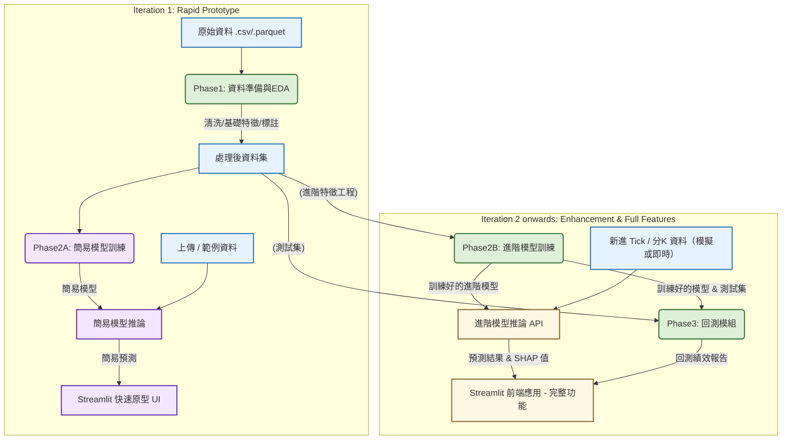

# 金融期貨 Tick 資料即時預測系統

> Side Project: 針對台指期等 Tick／分K 資料進行即時特徵工程、預測與回測驗證的 Streamlit 應用

## 專案目標

建立一個能針對台指期等 Tick / 分K 資料進行 **即時特徵工程 + 預測 + 回測驗證** 的 **可視化預測系統**。
最終部署為 Streamlit 應用，未來可銜接 WebSocket 即時資料與真實交易 API。

## 主要階段與功能

本專案依照詳細執行計畫 ([`PROJECT_PLAN.md`](./PROJECT_PLAN.md)) 分為以下主要階段：

1.  **⓪ 專案初始化與環境設定**
    *   建立專案目錄結構。
    *   初始化 Git 版本控制。
    *   建立 `requirements.txt` 並設定 Python 虛擬環境。
    *   安裝依賴套件。

2.  **① 第一階段：資料準備與探索 (Data Preparation & EDA)**
    *   **資料載入與初步檢視**: 讀取歷史資料，確認欄位、型態、筆數、時間範圍。
    *   **資料清洗**: 處理缺失值、異常價格、重複資料。
    *   **時間序列處理**: 設定時間索引，標準化時間格式，處理非交易時間。
    *   **初步探索性資料分析 (EDA)**: 可視化價格、成交量、波動率、分佈等。
    *   **技術指標特徵工程 (基礎)**: 計算 SMA, EMA, RSI 等核心指標。
    *   **標註欄位製作 (Target Labeling)**: 定義預測目標並產生標註 (e.g., 未來 N tick 漲跌)。
    *   *對應 Notebook: [`notebooks/01_Phase1_Data_Preparation_EDA.ipynb`](./notebooks/01_Phase1_Data_Preparation_EDA.ipynb)*

3.  **②.A 快速原型：簡易模型與前端展示 (Rapid Prototype)**
    *   **資料切分 (簡易)**: 隨機切分訓練/測試集。
    *   **訓練極簡模型**: 如 Logistic Regression 或簡易 XGBoost，目標是打通流程。
    *   **Streamlit UI 雛形**: 基本佈局，資料上傳，模型推論整合與初步結果展示。
    *   *模型訓練對應 Notebook: [`notebooks/02a_Phase2A_Rapid_Prototyping.ipynb`](./notebooks/02a_Phase2A_Rapid_Prototyping.ipynb)*
    *   *前端實作於 `app/` 目錄*

4.  **②.B 第二階段：模型訓練與預測模組 (進階)**
    *   **模型選擇與特徵設計**:
        *   探討 RandomForest 的不足，選擇適合時序的模型 (LSTM, GRU, Transformer, TSFresh + Tree-based)。
        *   設計並加入「跨時間點」核心特徵 (均線斜率, VWAP 偏離, 前 N 分鐘極值等)。
    *   **標註欄位設計**: 深入探討常見標註方式、動態上下界、多階段標註。
    *   **時序資料切分**: 使用 `TimeSeriesSplit`，考慮跨週 CV、滾動窗口訓練。
    *   **訓練與驗證 Pipeline**: 建立包含預處理、(過/欠)採樣、模型訓練的 Pipeline。
    *   **模型評估與解釋性**: 使用多種指標評估，並透過 SHAP 等工具進行模型解釋。
    *   *對應 Notebook: [`notebooks/02b_Phase2B_Advanced_Models.ipynb`](./notebooks/02b_Phase2B_Advanced_Models.ipynb)*

5.  **③ 第三階段：回測與績效驗證**
    *   **回測邏輯設計**: 定義交易訊號、進出場條件、停損停利、交易成本。
    *   **回測引擎實現**: 在測試集上根據模型預測執行回測。
    *   **績效指標計算與分析**: PnL, 勝率, 最大回撤, Sharpe Ratio 等。
    *   (進階) Walk-Forward Validation, 參數化策略回測。
    *   *對應 Notebook: [`notebooks/03_Phase3_Backtesting.ipynb`](./notebooks/03_Phase3_Backtesting.ipynb)*

6.  **④ 第四階段：前端功能完善與即時化**
    *   整合進階模型預測至 Streamlit。
    *   增強前端可視化 (價格圖疊加技術指標、預測訊號標記)。
    *   整合 SHAP 解釋圖。
    *   儲存預測紀錄與模型版本。
    *   (進階) 串接模擬即時資料源 (WebSocket)。

7.  **⑤ 第五階段：自動化與部署 (選做/遠期)**
    *   Docker 化專案。
    *   設定 CI/CD 或定時重訓。
    *   串接虛擬交易 API 進行 Paper Trading。

---

## 核心技術棧

*   **資料處理與分析：** `pandas`, `numpy`
*   **技術指標計算：** `ta-lib`
*   **機器學習/深度學習：**
    *   初期：`scikit-learn`, `xgboost`
    *   進階：`tensorflow/keras`, `pytorch` (LSTM/Transformer)
*   **模型解釋性：** `shap`
*   **回測框架：** 簡易自建，或考慮 `backtrader`, `bt`
*   **前端與可視化：** `streamlit`, `plotly`, `matplotlib`
*   **版本控制：** `Git`
*   **開發環境：** `Jupyter Notebook` (EDA 與實驗), Python IDE

---

## 目錄結構

```text
.
├── README.md
├── PROJECT_PLAN.md  # 詳細專案計畫
├── requirements.txt
├── data/
│   ├── raw/            # Tick/分K 原始檔
│   └── processed/      # 經過清洗與分K後的資料 (及帶特徵的資料)
├── features/
│   ├── feature_engineering.py
│   └── labeling.py
├── utils/
│   ├── data_cleaner.py
│   ├── data_loader.py
│   ├── data_splitter.py
│   ├── eda_analyzer.py
│   └── performance_metrics.py
├── models/
│   ├── simple_model_trainer.py # (可整合至 Notebook 或保留)
│   ├── train_xgboost.py        # (可整合至 Notebook 或保留)
│   └── trained_models/         # 儲存所有 .pkl/.joblib 模型
├── backtest/
│   ├── core_logic.py
│   └── run_backtest.py
├── app/
│   ├── main_app.py
│   ├── pages/              # Streamlit 多頁面應用
│   │   ├── 1_Train_Model.py
│   │   ├── 2_Predict_Live.py
│   │   └── 3_Backtest_Results.py
└── notebooks/
    ├── 01_Phase1_Data_Preparation_EDA.ipynb
    ├── 02a_Phase2A_Rapid_Prototyping.ipynb
    ├── 02b_Phase2B_Advanced_Models.ipynb
    ├── 03_Phase3_Backtesting.ipynb
    └── (archive)/ # 可放置舊版或實驗性 Notebook
        └── 01_data_loading_and_inspection.ipynb # 原始 Notebook 範例
```

---

## 快速開始

1.  **Clone 專案 & 安裝依賴**
    ```bash
    git clone <your-repository-url> futures-tick-predictor
    cd futures-tick-predictor
    python -m venv venv
    source venv/bin/activate      # Linux/Mac
    # .\venv\Scripts\activate    # Windows
    pip install -r requirements.txt
    ```

2.  **準備資料**
    *   將歷史 Tick/分K CSV 或 Parquet 檔案放到 `data/raw/` 目錄下。

3.  **執行 Jupyter Notebooks**
    *   **階段 ①**: 打開並執行 [`notebooks/01_Phase1_Data_Preparation_EDA.ipynb`](./notebooks/01_Phase1_Data_Preparation_EDA.ipynb) 進行資料載入、清洗、EDA 及基礎特徵工程與標註。產生的帶特徵資料建議儲存到 `data/processed/`。
    *   **階段 ②.A**: 打開並執行 [`notebooks/02a_Phase2A_Rapid_Prototyping.ipynb`](./notebooks/02a_Phase2A_Rapid_Prototyping.ipynb) 訓練簡易模型。模型將儲存到 `trained_models/`。
    *   **階段 ②.B**: 打開並執行 [`notebooks/02b_Phase2B_Advanced_Models.ipynb`](./notebooks/02b_Phase2B_Advanced_Models.ipynb) 訓練進階模型。模型將儲存到 `trained_models/`。
    *   **階段 ③**: 打開並執行 [`notebooks/03_Phase3_Backtesting.ipynb`](./notebooks/03_Phase3_Backtesting.ipynb) 進行回測。

4.  **運行 Streamlit 應用**
    ```bash
    streamlit run app/main_app.py
    ```
    *   應用程式將提供介面來載入模型、輸入資料、進行預測、展示回測結果等。

---

## 核心流程示意 (Mermaid)



---

## 貢獻與未來擴充

參考 [`PROJECT_PLAN.md`](./PROJECT_PLAN.md) 中的第四、五階段以及其他潛在擴展點，例如：

*   更複雜的特徵工程 (如 TSFresh)。
*   更先進的模型架構 (如 Temporal Fusion Transformers)。
*   更完善的 Streamlit 互動頁面。
*   完整的 CI/CD 流程與自動化模型重訓。
*   實際串接即時資料源與模擬交易 API。

---

## License

本專案採用 MIT License

---

> **作者**：Yidti
> **聯絡**：[bonjour.luc@gmail.com](mailto:bonjour.luc@gmail.com)
